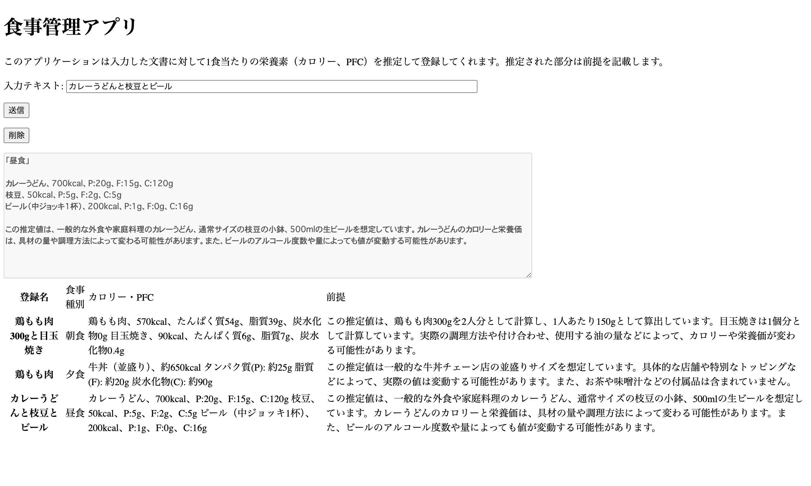
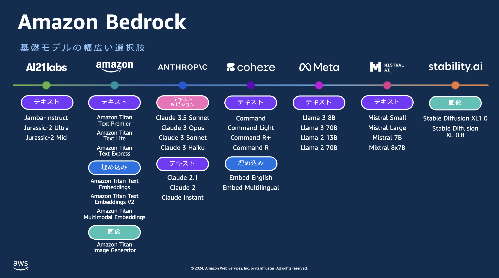

# ①課題番号-プロダクト名

食事管理アプリ

## ②課題内容（どんな作品か）

- 食事内容や食材の情報を入れると、自動で1人分のカロリーやPFCを推定して登録してくれるアプリです。

## ③DEMO
- さくらサーバ
    -  https://tech-yusuke.sakura.ne.jp/local-storage/index.html
- AWS amplify
    - https://main.dej7rmpkxp56i.amplifyapp.com/
-  

## ④作ったアプリケーション用のIDまたはPasswordがある場合
- ID：dev@challenge-project.com
- PW：zK2n*N_m
<!-- - ID: 〇〇〇〇〇〇〇〇
- PW: 〇〇〇〇〇〇〇〇 -->

## ⑤工夫した点・こだわった点
- 高性能な生成AI（Claude3.5 sonnet）を利用できるようにした。
- フロントエンドからのリクエストに認証を必要とする仕組みを取り入れ、許可された人だけが利用できるような仕組みを実現した。
- 裏でシステムプロンプトを入れることで意図に沿った回答を得られるように調整した。
- 以前に引き続き、さくらとAWS両方でデプロイしつつ、NewRelicを導入した。

## ⑥難しかった点・次回トライしたいこと(又は機能)
- 難しかった点
    - フロントエンドのコードだけでは安全に生成AIを使うことができなかったので、バックエンドにlambdaとAPIGatewayを使った構成にしました。この構成に辿り着くまでも大変でした。
    - Cognitoの認証を入れた際、最初そもそもやり方が分からなかったりCORSのエラーが出たりと苦戦しました。
- 次回トライしたいこと
    - 見た目をこだわって、グラフ化できるようにしたり日付で遡れるようにしたい。
    - 今後も出来上がった機能をさくらサーバでのデプロイと、AWSの各機能を連携させたデプロイの両方を行っていきたい。その際CloudFormationを使いリソース管理できるようにしたい。
    - AWSのデプロイについて、githubと連携させた形でサイトの内容やインフラ設定を変更できるようにしたい。
    - NewRelicでどのような情報が確認できるかについて詳しくみていきたい。
        - さくらサーバとCloudFrontの違いについても確認していきたい。
    - Ragの機能を使ってより正確な情報を取得できるようにしたい。

## ⑦質問・疑問・感想、シェアしたいこと等なんでも
- [感想]
    - AmazonBedrockを使って最近話題の生成AIをアプリに組み込む手法が実践できたり、あまり実際に触ったことのないlambdaやAPIGateway、Cognitoを連携させつつ動作させることができて学びが多かったです。
    - 
- [参考記事]
  - AmazonBedrockのAWSオンラインセミナー
    - [AWS Builders Online](https://vmxwvcrs.r.us-east-1.awstrack.me/L0/https:%2F%2Femail.awscloud.com%2FMTEyLVRaTS03NjYAAAGUX1vpU0QpPyokxMrXHQne45LJ5NwZXpWcwf6djpPOGhRBW81jR8rcLjtdZ-R1SPuIZl862Cg=/1/01000190c0634b01-60908589-aec7-4608-868d-b26db1350521-000000/gIjk1Mm1uyS6k0pExGSeMKxqHtU=383)
  - 資料
    - [BOS-04: 生成 AI コワクナイヨ！AWS マネジメントコンソールで始める Amazon Bedrock](https://pages.awscloud.com/rs/112-TZM-766/images/BOS-04_AWS-Builders-Online-Series_2024-Q3_Presentation-Deck_generative-AI-1.pdf)
    - [BOS-05: Builder なら API で Amazon Bedrock を使ってみよう！超簡単 API コールの手ほどき](https://pages.awscloud.com/rs/112-TZM-766/images/BOS-05_AWS-Builders-Online-Series_2024-Q3_Presentation-Deck_generative-AI-2.pdf)
    - [BOS-06: 明日からすぐに使える自分で作る生成 AI アプリケーション〜Chat with your document〜](https://pages.awscloud.com/rs/112-TZM-766/images/BOS-06_AWS-Builders-Online-Series_2024-Q3_Presentation-Deck_generative-AI-3.pdf)
    - [BOS-07: 業務で利用できる生成 AI ソリューションのデプロイと、実装を一緒に覗いてみよう](https://pages.awscloud.com/rs/112-TZM-766/images/BOS-07_AWS-Builders-Online-Series_2024-Q3_Presentation-Deck_generative-AI-4.pdf)
    - https://dev.classmethod.jp/articles/cfn-s3-webhosting-cloudfront/
  - GenU（AWS公式、生成AIのユースケースを簡単に試せるアプリケーションコード）
    - https://github.com/aws-samples/generative-ai-use-cases-jp
  - BedRock、APIGateway、Lambda、Amplifyを使ったwebアプリ実装ワークショップ
    - https://catalog.us-east-1.prod.workshops.aws/workshops/0da6f9f4-c42f-4d47-90df-f89f4ab57e41/ja-JP/05-lambda
  - Cognito連携
    - https://qiita.com/suiwave/items/713976e627348ba8be18
 
